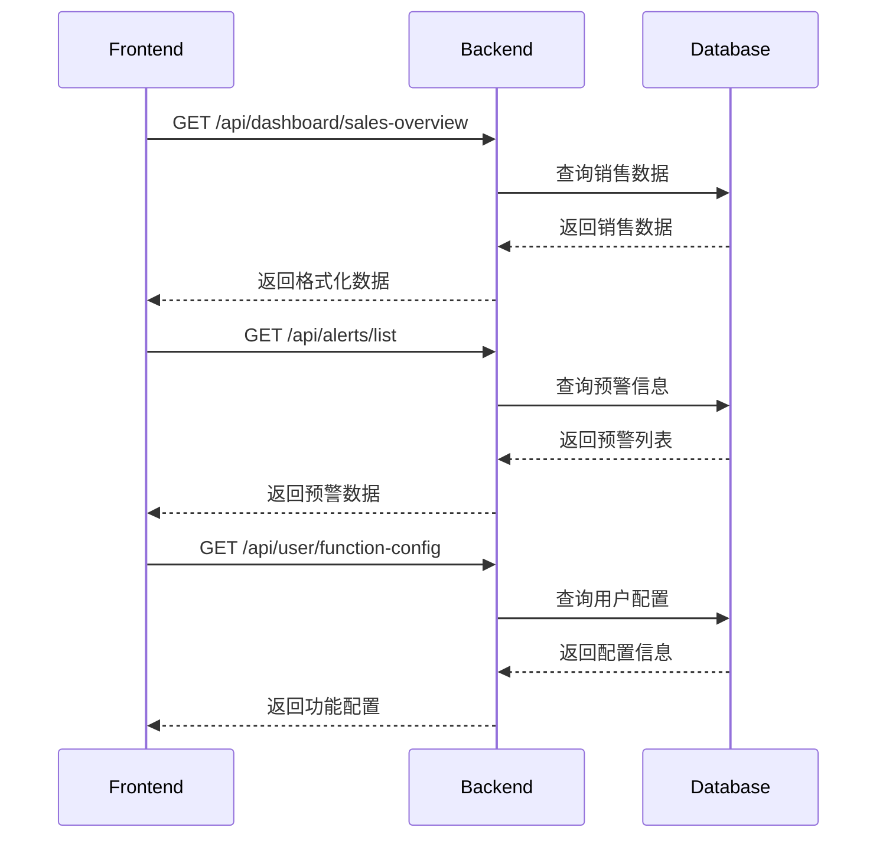

# HomePage 主界面开发文档

## 📋 概述

本文档详细说明了超越商务应用主界面（HomePage.vue）与后端Java系统的交互设计，包括API接口定义、数据库设计、前后端数据流等。

## 🏗️ 系统架构

### 前端架构
```
HomePage.vue
├── 顶部导航栏 (TopNavigation)
├── 数据看板 (DataDashboard)
├── 快速功能 (QuickFunctions)
├── 目标管理 (GoalManagement)
└── 底部导航 (BottomNavigation)
```

### 后端架构
```
Spring Boot Application
├── Controller Layer (REST API)
├── Service Layer (业务逻辑)
├── Repository Layer (数据访问)
└── Database (MySQL/PostgreSQL)
```

## 🔌 API接口设计

### 1. 数据看板接口

#### 1.1 获取销售数据概览
```http
GET /api/dashboard/sales-overview
```

**响应数据结构：**
```json
{
  "code": 200,
  "message": "success",
  "data": {
    "currentMonth": {
      "totalSales": 38144.74,
      "netSales": 37188.06,
      "settledSales": 17038.58,
      "unsettledSales": 20149.48,
      "returnAmount": 956.68
    },
    "lastMonth": {
      "totalSales": 227356.95
    },
    "today": {
      "totalSales": 5580.00
    },
    "yesterday": {
      "totalSales": 3294.34
    },
    "receivables": 419596.78,
    "customerPayment": {
      "monthTotal": 23258.48,
      "todayAmount": 232.00
    }
  }
}
```

#### 1.2 获取数据详情
```http
GET /api/dashboard/data-detail/{type}
```

**参数说明：**
- `type`: 数据类型 (current-month-sales, net-sales, settled-sales等)

**响应数据结构：**
```json
{
  "code": 200,
  "message": "success",
  "data": {
    "title": "本月销售金额",
    "formula": "本月销售金额 = 销售订单总额 - 退货金额",
    "breakdown": [
      {
        "id": 1,
        "name": "销售订单总额",
        "value": "39,101.42元"
      },
      {
        "id": 2,
        "name": "退货金额",
        "value": "-956.68元"
      }
    ]
  }
}
```

### 2. 预警信息接口

#### 2.1 获取预警列表
```http
GET /api/alerts/list
```

**响应数据结构：**
```json
{
  "code": 200,
  "message": "success",
  "data": [
    {
      "id": 1,
      "message": "小易监控到的经营异常",
      "priority": "high",
      "type": "business_exception",
      "timestamp": "2024-08-15T10:30:00Z",
      "details": {
        "description": "客户张三连续3天未下单",
        "suggestion": "建议主动联系客户了解情况"
      }
    }
  ]
}
```

### 3. 搜索接口

#### 3.1 全局搜索
```http
POST /api/search/global
```

**请求参数：**
```json
{
  "keyword": "张三",
  "types": ["customer", "order", "employee"],
  "limit": 20
}
```

**响应数据结构：**
```json
{
  "code": 200,
  "message": "success",
  "data": [
    {
      "id": "C001",
      "type": "客户",
      "title": "张三",
      "description": "北京市朝阳区 | 累计消费：50,000元",
      "route": "/customer/detail/C001"
    }
  ]
}
```

### 4. 快速功能接口

#### 4.1 获取用户功能配置
```http
GET /api/user/function-config
```

**响应数据结构：**
```json
{
  "code": 200,
  "message": "success",
  "data": {
    "selectedFunctions": [
      {
        "id": "employee_report",
        "name": "员工月报",
        "icon": "users",
        "route": "/employee-report",
        "order": 1
      }
    ]
  }
}
```

#### 4.2 保存功能配置
```http
POST /api/user/function-config
```

**请求参数：**
```json
{
  "selectedFunctions": [
    {
      "id": "employee_report",
      "order": 1
    }
  ]
}
```

### 5. 目标管理接口

#### 5.1 获取目标列表
```http
GET /api/goals/list
```

**响应数据结构：**
```json
{
  "code": 200,
  "message": "success",
  "data": [
    {
      "id": 1,
      "title": "2个目标进行中",
      "goals": [
        {
          "id": "G001",
          "name": "销售金额",
          "period": "2025-01-01 - 2025-12-31",
          "target": 20000.00,
          "achieved": 40423.13,
          "completionRate": "2021.16%",
          "status": "超额完成",
          "difference": "超额完成"
        }
      ]
    }
  ]
}
```

## 🗄️ 数据库设计

### 1. 销售数据表 (sales_data)
```sql
CREATE TABLE sales_data (
    id BIGINT PRIMARY KEY AUTO_INCREMENT,
    user_id BIGINT NOT NULL,
    date DATE NOT NULL,
    total_sales DECIMAL(15,2) DEFAULT 0,
    net_sales DECIMAL(15,2) DEFAULT 0,
    settled_sales DECIMAL(15,2) DEFAULT 0,
    unsettled_sales DECIMAL(15,2) DEFAULT 0,
    return_amount DECIMAL(15,2) DEFAULT 0,
    receivables DECIMAL(15,2) DEFAULT 0,
    customer_payment DECIMAL(15,2) DEFAULT 0,
    created_at TIMESTAMP DEFAULT CURRENT_TIMESTAMP,
    updated_at TIMESTAMP DEFAULT CURRENT_TIMESTAMP ON UPDATE CURRENT_TIMESTAMP,
    INDEX idx_user_date (user_id, date)
);
```

### 2. 预警信息表 (alerts)
```sql
CREATE TABLE alerts (
    id BIGINT PRIMARY KEY AUTO_INCREMENT,
    user_id BIGINT NOT NULL,
    message VARCHAR(500) NOT NULL,
    priority ENUM('low', 'medium', 'high') DEFAULT 'medium',
    type VARCHAR(50) NOT NULL,
    details JSON,
    is_read BOOLEAN DEFAULT FALSE,
    created_at TIMESTAMP DEFAULT CURRENT_TIMESTAMP,
    INDEX idx_user_priority (user_id, priority),
    INDEX idx_created_at (created_at)
);
```

### 3. 用户功能配置表 (user_function_config)
```sql
CREATE TABLE user_function_config (
    id BIGINT PRIMARY KEY AUTO_INCREMENT,
    user_id BIGINT NOT NULL,
    function_id VARCHAR(50) NOT NULL,
    display_order INT DEFAULT 0,
    is_enabled BOOLEAN DEFAULT TRUE,
    created_at TIMESTAMP DEFAULT CURRENT_TIMESTAMP,
    updated_at TIMESTAMP DEFAULT CURRENT_TIMESTAMP ON UPDATE CURRENT_TIMESTAMP,
    UNIQUE KEY uk_user_function (user_id, function_id),
    INDEX idx_user_order (user_id, display_order)
);
```

### 4. 目标管理表 (goals)
```sql
CREATE TABLE goals (
    id BIGINT PRIMARY KEY AUTO_INCREMENT,
    user_id BIGINT NOT NULL,
    name VARCHAR(100) NOT NULL,
    target_value DECIMAL(15,2) NOT NULL,
    achieved_value DECIMAL(15,2) DEFAULT 0,
    start_date DATE NOT NULL,
    end_date DATE NOT NULL,
    status ENUM('active', 'completed', 'paused') DEFAULT 'active',
    created_at TIMESTAMP DEFAULT CURRENT_TIMESTAMP,
    updated_at TIMESTAMP DEFAULT CURRENT_TIMESTAMP ON UPDATE CURRENT_TIMESTAMP,
    INDEX idx_user_status (user_id, status),
    INDEX idx_date_range (start_date, end_date)
);
```

## 🔄 前后端数据流

### 1. 页面初始化流程


### 2. 实时数据更新
```javascript
// 前端实现
export default {
  data() {
    return {
      refreshTimer: null,
      salesData: {},
      alerts: []
    }
  },
  
  mounted() {
    this.initializeData()
    this.startAutoRefresh()
  },
  
  methods: {
    async initializeData() {
      await Promise.all([
        this.loadSalesData(),
        this.loadAlerts(),
        this.loadFunctionConfig()
      ])
    },
    
    async loadSalesData() {
      try {
        const response = await this.$http.get('/api/dashboard/sales-overview')
        this.salesData = response.data.data
      } catch (error) {
        this.$message.error('加载销售数据失败')
      }
    },
    
    startAutoRefresh() {
      this.refreshTimer = setInterval(() => {
        this.loadSalesData()
        this.loadAlerts()
      }, 300000) // 5分钟刷新一次
    }
  }
}
```

## 🔧 后端实现示例

### 1. Controller层
```java
@RestController
@RequestMapping("/api/dashboard")
@Slf4j
public class DashboardController {
    
    @Autowired
    private DashboardService dashboardService;
    
    @GetMapping("/sales-overview")
    public ApiResponse<SalesOverviewDTO> getSalesOverview(
            @RequestHeader("Authorization") String token) {
        Long userId = JwtUtil.getUserIdFromToken(token);
        SalesOverviewDTO data = dashboardService.getSalesOverview(userId);
        return ApiResponse.success(data);
    }
    
    @GetMapping("/data-detail/{type}")
    public ApiResponse<DataDetailDTO> getDataDetail(
            @PathVariable String type,
            @RequestHeader("Authorization") String token) {
        Long userId = JwtUtil.getUserIdFromToken(token);
        DataDetailDTO data = dashboardService.getDataDetail(userId, type);
        return ApiResponse.success(data);
    }
}
```

### 2. Service层
```java
@Service
@Transactional
public class DashboardService {
    
    @Autowired
    private SalesDataRepository salesDataRepository;
    
    public SalesOverviewDTO getSalesOverview(Long userId) {
        LocalDate today = LocalDate.now();
        LocalDate monthStart = today.withDayOfMonth(1);
        LocalDate lastMonthStart = monthStart.minusMonths(1);
        LocalDate lastMonthEnd = monthStart.minusDays(1);
        
        // 查询本月数据
        SalesData currentMonth = salesDataRepository
            .findByUserIdAndDateBetween(userId, monthStart, today)
            .stream()
            .reduce(new SalesData(), this::mergeSalesData);
            
        // 查询上月数据
        SalesData lastMonth = salesDataRepository
            .findByUserIdAndDateBetween(userId, lastMonthStart, lastMonthEnd)
            .stream()
            .reduce(new SalesData(), this::mergeSalesData);
            
        return SalesOverviewDTO.builder()
            .currentMonth(convertToCurrentMonthDTO(currentMonth))
            .lastMonth(convertToLastMonthDTO(lastMonth))
            .build();
    }
}
```

## 📱 前端状态管理

### 1. Vuex Store设计
```javascript
// store/modules/dashboard.js
export default {
  namespaced: true,
  
  state: {
    salesData: {},
    alerts: [],
    functionConfig: [],
    loading: false
  },
  
  mutations: {
    SET_SALES_DATA(state, data) {
      state.salesData = data
    },
    SET_ALERTS(state, alerts) {
      state.alerts = alerts
    },
    SET_LOADING(state, loading) {
      state.loading = loading
    }
  },
  
  actions: {
    async fetchSalesData({ commit }) {
      commit('SET_LOADING', true)
      try {
        const response = await api.get('/dashboard/sales-overview')
        commit('SET_SALES_DATA', response.data.data)
      } finally {
        commit('SET_LOADING', false)
      }
    }
  }
}
```

## 🔒 安全考虑

### 1. 认证授权
- 所有API请求需要携带JWT Token
- 后端验证Token有效性和用户权限
- 敏感数据加密传输

### 2. 数据验证
- 前端表单验证
- 后端参数校验
- SQL注入防护

### 3. 错误处理
```javascript
// 统一错误处理
axios.interceptors.response.use(
  response => response,
  error => {
    if (error.response?.status === 401) {
      // 跳转登录页
      router.push('/login')
    } else if (error.response?.status >= 500) {
      // 显示系统错误
      Message.error('系统异常，请稍后重试')
    }
    return Promise.reject(error)
  }
)
```

## 🚀 性能优化

### 1. 前端优化
- 组件懒加载
- 数据缓存策略
- 防抖节流处理
- 虚拟滚动

### 2. 后端优化
- 数据库索引优化
- 查询结果缓存
- 分页查询
- 异步处理

### 3. 网络优化
- API响应压缩
- CDN加速
- 请求合并
- 缓存策略

## 📊 监控告警

### 1. 前端监控
- 页面加载性能
- API请求成功率
- 用户行为统计

### 2. 后端监控
- 接口响应时间
- 数据库连接池
- 系统资源使用

## 🛠️ 开发环境配置

### 1. 前端环境
```bash
# 安装依赖
npm install

# 开发环境启动
npm run serve

# 生产环境构建
npm run build
```

### 2. 后端环境
```yaml
# application.yml
spring:
  datasource:
    url: jdbc:mysql://localhost:3306/chaoyue_business
    username: ${DB_USERNAME:root}
    password: ${DB_PASSWORD:password}
    driver-class-name: com.mysql.cj.jdbc.Driver

  jpa:
    hibernate:
      ddl-auto: update
    show-sql: false
    properties:
      hibernate:
        format_sql: true

  redis:
    host: localhost
    port: 6379
    password: ${REDIS_PASSWORD:}

server:
  port: 8080

logging:
  level:
    com.chaoyue.business: DEBUG
```

## 📋 开发规范

### 1. 前端代码规范
```javascript
// 组件命名：PascalCase
// 文件命名：kebab-case
// 变量命名：camelCase
// 常量命名：UPPER_SNAKE_CASE

// API调用示例
async loadDashboardData() {
  try {
    this.loading = true
    const [salesData, alerts] = await Promise.all([
      this.$api.dashboard.getSalesOverview(),
      this.$api.alerts.getList()
    ])

    this.salesData = salesData
    this.alerts = alerts
  } catch (error) {
    this.$message.error('数据加载失败')
    console.error('Dashboard data loading error:', error)
  } finally {
    this.loading = false
  }
}
```

### 2. 后端代码规范
```java
// 统一响应格式
@Data
@Builder
@NoArgsConstructor
@AllArgsConstructor
public class ApiResponse<T> {
    private Integer code;
    private String message;
    private T data;
    private Long timestamp;

    public static <T> ApiResponse<T> success(T data) {
        return ApiResponse.<T>builder()
            .code(200)
            .message("success")
            .data(data)
            .timestamp(System.currentTimeMillis())
            .build();
    }

    public static <T> ApiResponse<T> error(Integer code, String message) {
        return ApiResponse.<T>builder()
            .code(code)
            .message(message)
            .timestamp(System.currentTimeMillis())
            .build();
    }
}
```

## 🧪 测试策略

### 1. 前端测试
```javascript
// 单元测试示例 (Jest + Vue Test Utils)
import { shallowMount } from '@vue/test-utils'
import HomePage from '@/views/HomePage.vue'

describe('HomePage.vue', () => {
  it('should load sales data on mount', async () => {
    const wrapper = shallowMount(HomePage, {
      mocks: {
        $api: {
          dashboard: {
            getSalesOverview: jest.fn().mockResolvedValue({
              currentMonth: { totalSales: 38144.74 }
            })
          }
        }
      }
    })

    await wrapper.vm.$nextTick()
    expect(wrapper.vm.salesData.currentMonth.totalSales).toBe(38144.74)
  })
})
```

### 2. 后端测试
```java
@SpringBootTest
@AutoConfigureTestDatabase(replace = AutoConfigureTestDatabase.Replace.NONE)
class DashboardServiceTest {

    @Autowired
    private DashboardService dashboardService;

    @MockBean
    private SalesDataRepository salesDataRepository;

    @Test
    void shouldReturnSalesOverview() {
        // Given
        Long userId = 1L;
        SalesData mockData = SalesData.builder()
            .totalSales(new BigDecimal("38144.74"))
            .build();

        when(salesDataRepository.findByUserIdAndDateBetween(any(), any(), any()))
            .thenReturn(Arrays.asList(mockData));

        // When
        SalesOverviewDTO result = dashboardService.getSalesOverview(userId);

        // Then
        assertThat(result.getCurrentMonth().getTotalSales())
            .isEqualTo(new BigDecimal("38144.74"));
    }
}
```

## 📈 部署方案

### 1. Docker部署
```dockerfile
# 前端Dockerfile
FROM node:16-alpine as build
WORKDIR /app
COPY package*.json ./
RUN npm ci --only=production
COPY . .
RUN npm run build

FROM nginx:alpine
COPY --from=build /app/dist /usr/share/nginx/html
COPY nginx.conf /etc/nginx/nginx.conf
EXPOSE 80
CMD ["nginx", "-g", "daemon off;"]
```

```dockerfile
# 后端Dockerfile
FROM openjdk:11-jre-slim
VOLUME /tmp
COPY target/chaoyue-business-*.jar app.jar
ENTRYPOINT ["java","-jar","/app.jar"]
EXPOSE 8080
```

### 2. docker-compose.yml
```yaml
version: '3.8'
services:
  frontend:
    build: ./frontend
    ports:
      - "80:80"
    depends_on:
      - backend

  backend:
    build: ./backend
    ports:
      - "8080:8080"
    environment:
      - DB_HOST=mysql
      - REDIS_HOST=redis
    depends_on:
      - mysql
      - redis

  mysql:
    image: mysql:8.0
    environment:
      MYSQL_ROOT_PASSWORD: password
      MYSQL_DATABASE: chaoyue_business
    volumes:
      - mysql_data:/var/lib/mysql

  redis:
    image: redis:alpine

volumes:
  mysql_data:
```

---

**文档版本**: v1.0
**最后更新**: 2025-08-15
**维护人员**: 开发团队
