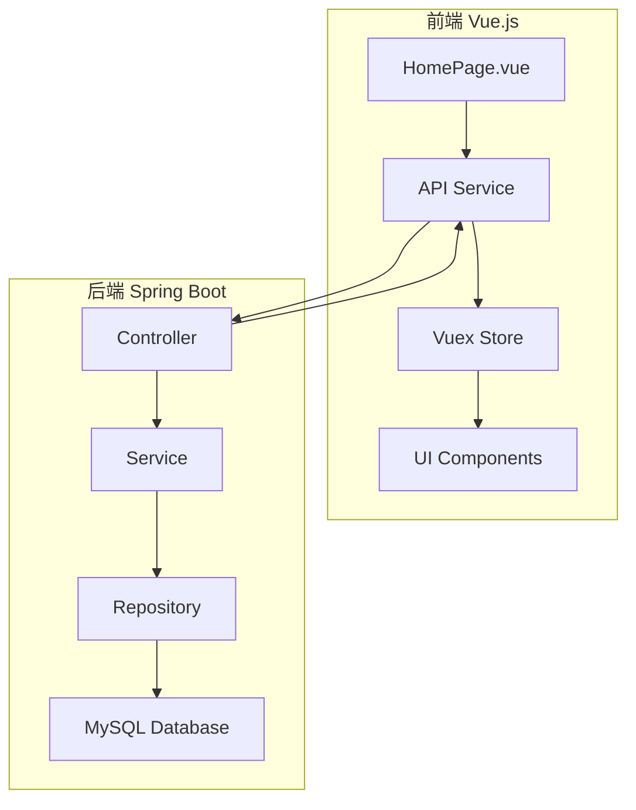

# 主界面开发指南

## 📋 概述

本指南为超越商务应用主界面开发提供完整的技术文档和开发流程，帮助开发团队快速上手并高效开发。

## 📚 核心文档

### 🎯 必读文档

#### 1. [HomePage开发文档](./HomePage开发文档.md) ⭐⭐⭐⭐⭐
**完整的主界面开发指南**
- 系统架构设计
- 前后端交互流程
- 组件设计规范
- 性能优化方案
- 测试策略

#### 2. [API接口文档](./API接口文档.md) ⭐⭐⭐⭐⭐
**所有API接口的详细说明**
- 数据看板接口
- 预警信息接口
- 搜索功能接口
- 用户配置接口
- 目标管理接口

#### 3. [主界面数据库设计](./主界面数据库设计.md) ⭐⭐⭐⭐
**数据库表结构和优化方案**
- 核心业务表设计
- 索引优化策略
- 常用查询语句
- 性能监控方案

#### 4. [前后端集成指南](./前后端集成指南.md) ⭐⭐⭐⭐
**前后端集成的完整流程**
- 开发环境配置
- API服务层设计
- 状态管理方案
- 错误处理机制

### 🎨 设计规范

#### 5. [设计规范](./rules.md) ⭐⭐⭐
**UI设计规范和组件标准**
- 配色方案
- 字体规范
- 组件设计
- 交互规范

## 🚀 快速开始

### 第一步：环境准备
1. **前端环境**
   ```bash
   # 安装Node.js (>= 14.0.0)
   # 安装Vue CLI
   npm install -g @vue/cli
   
   # 克隆项目
   git clone <repository-url>
   cd hello-world
   
   # 安装依赖
   npm install
   
   # 启动开发服务器
   npm run serve
   ```

2. **后端环境**
   ```bash
   # 安装Java 11+
   # 安装Maven 3.6+
   
   # 配置数据库连接
   # 参考：主界面数据库设计.md
   
   # 启动Spring Boot应用
   mvn spring-boot:run
   ```

### 第二步：理解架构


### 第三步：核心功能开发

#### 数据看板开发
```javascript
// 1. API调用
const salesData = await api.dashboard.getSalesOverview()

// 2. 状态管理
this.$store.dispatch('dashboard/fetchSalesData')

// 3. 组件渲染
<div class="sales-card">
  <div class="sales-value">{{ salesData.currentMonth.totalSales }}</div>
  <div class="sales-label">本月销售金额</div>
</div>
```

#### 预警系统开发
```javascript
// 1. 获取预警列表
const alerts = await api.alerts.getList({ unreadOnly: true })

// 2. 轮播显示
this.startAlertRotation()

// 3. 标记已读
await api.alerts.markAsRead(alertId)
```

## 📖 开发规范

### 代码规范
```javascript
// 前端命名规范
export default {
  name: 'HomePage',           // 组件名：PascalCase
  data() {
    return {
      salesData: {},          // 变量名：camelCase
      API_BASE_URL: ''        // 常量名：UPPER_SNAKE_CASE
    }
  }
}
```

```java
// 后端命名规范
@RestController
@RequestMapping("/api/dashboard")
public class DashboardController {    // 类名：PascalCase
    
    private static final String SUCCESS_MESSAGE = "操作成功";  // 常量：UPPER_SNAKE_CASE
    
    @GetMapping("/sales-overview")
    public ApiResponse<SalesOverviewDTO> getSalesOverview() {  // 方法名：camelCase
        // 实现逻辑
    }
}
```

### Git提交规范
```bash
# 提交格式
<type>(<scope>): <subject>

# 示例
feat(dashboard): 添加销售数据看板功能
fix(api): 修复预警接口返回数据格式错误
docs(readme): 更新开发文档
```

## 🔧 开发工具

### 推荐IDE和插件
- **前端**: VS Code + Vetur + ESLint + Prettier
- **后端**: IntelliJ IDEA + Lombok + MyBatis Log Plugin
- **数据库**: Navicat / DBeaver
- **API测试**: Postman / Swagger

### 调试技巧
```javascript
// 前端调试
console.log('API Response:', response.data)
this.$message.success('操作成功')

// 使用Vue DevTools查看组件状态
// 使用Network面板查看API请求
```

```java
// 后端调试
@Slf4j
public class DashboardService {
    public SalesOverviewDTO getSalesOverview(Long userId) {
        log.debug("获取用户{}的销售概览", userId);
        // 业务逻辑
    }
}
```

## 📊 核心功能模块

### 1. 数据看板模块
**功能**: 展示销售数据概览
- 本月/上月销售对比
- 今日/昨日销售对比
- 详细数据钻取
- 实时数据刷新

**技术要点**:
- 数据缓存策略
- 图表组件集成
- 响应式设计

### 2. 预警系统模块
**功能**: 智能预警信息展示
- 多优先级预警
- 轮播展示机制
- 预警详情查看
- 已读状态管理

**技术要点**:
- WebSocket实时推送
- 消息队列处理
- 状态同步机制

### 3. 快速功能模块
**功能**: 用户自定义功能入口
- 功能配置管理
- 拖拽排序
- 图标系统
- 路由跳转

**技术要点**:
- 组件动态加载
- 用户配置持久化
- 权限控制

### 4. 搜索功能模块
**功能**: 全局智能搜索
- 多类型搜索
- 搜索建议
- 历史记录
- 结果高亮

**技术要点**:
- 防抖处理
- 模糊匹配
- 搜索优化

## 🚨 常见问题

### Q1: 跨域问题如何解决？
**A**: 在开发环境中配置代理，生产环境配置CORS
```javascript
// vue.config.js
module.exports = {
  devServer: {
    proxy: {
      '/api': {
        target: 'http://localhost:8080',
        changeOrigin: true
      }
    }
  }
}
```

### Q2: 数据加载慢怎么优化？
**A**: 采用多种优化策略
- 数据缓存
- 分页加载
- 懒加载
- CDN加速

### Q3: 如何处理API错误？
**A**: 统一错误处理机制
```javascript
// 全局错误拦截
axios.interceptors.response.use(
  response => response,
  error => {
    this.$message.error('请求失败')
    return Promise.reject(error)
  }
)
```

## 📈 性能优化

### 前端优化
- **组件懒加载**: 按需加载组件
- **图片优化**: 使用WebP格式，懒加载
- **代码分割**: 路由级别的代码分割
- **缓存策略**: 合理使用浏览器缓存

### 后端优化
- **数据库优化**: 索引优化，查询优化
- **缓存策略**: Redis缓存热点数据
- **连接池**: 数据库连接池配置
- **异步处理**: 耗时操作异步化

## 📞 技术支持

### 联系方式
- **技术负责人**: 开发团队
- **文档维护**: 技术文档组
- **问题反馈**: GitHub Issues

### 学习资源
- [Vue.js官方文档](https://vuejs.org/)
- [Spring Boot官方文档](https://spring.io/projects/spring-boot)
- [MySQL官方文档](https://dev.mysql.com/doc/)
- [Element UI组件库](https://element.eleme.io/)

---

**文档版本**: v1.0  
**最后更新**: 2025-08-15  
**维护团队**: 超越商务应用开发团队

> 💡 **提示**: 建议按照文档顺序逐步学习，遇到问题及时查阅相关文档或联系技术支持。
