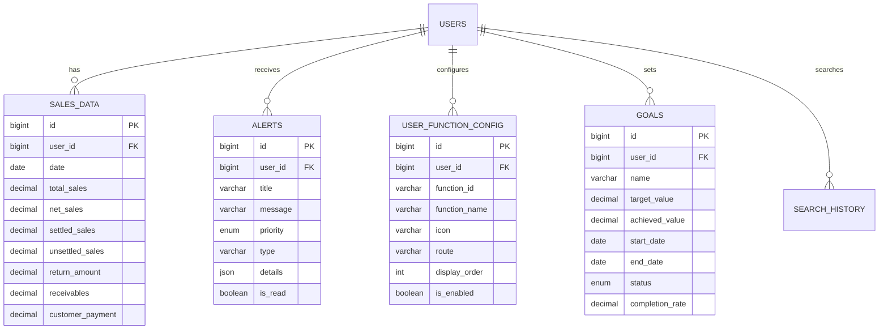

# 主界面数据库设计文档

## 📋 概述

本文档详细描述了支持主界面功能的数据库表结构设计，包括销售数据、预警信息、用户配置、目标管理等核心业务表。

## 🗄️ 核心数据表设计

### 1. 销售数据表 (sales_data)

**表说明：** 存储用户的销售数据，支持按日期统计和查询

```sql
CREATE TABLE sales_data (
    id BIGINT PRIMARY KEY AUTO_INCREMENT COMMENT '主键ID',
    user_id BIGINT NOT NULL COMMENT '用户ID',
    date DATE NOT NULL COMMENT '数据日期',
    total_sales DECIMAL(15,2) DEFAULT 0 COMMENT '总销售额',
    net_sales DECIMAL(15,2) DEFAULT 0 COMMENT '净销售额',
    settled_sales DECIMAL(15,2) DEFAULT 0 COMMENT '已结算销售额',
    unsettled_sales DECIMAL(15,2) DEFAULT 0 COMMENT '未结算销售额',
    return_amount DECIMAL(15,2) DEFAULT 0 COMMENT '退货金额',
    receivables DECIMAL(15,2) DEFAULT 0 COMMENT '应收余额',
    customer_payment DECIMAL(15,2) DEFAULT 0 COMMENT '客户回款',
    order_count INT DEFAULT 0 COMMENT '订单数量',
    customer_count INT DEFAULT 0 COMMENT '客户数量',
    created_at TIMESTAMP DEFAULT CURRENT_TIMESTAMP COMMENT '创建时间',
    updated_at TIMESTAMP DEFAULT CURRENT_TIMESTAMP ON UPDATE CURRENT_TIMESTAMP COMMENT '更新时间',
    
    INDEX idx_user_date (user_id, date),
    INDEX idx_date (date),
    UNIQUE KEY uk_user_date (user_id, date)
) ENGINE=InnoDB DEFAULT CHARSET=utf8mb4 COMMENT='销售数据表';
```

### 2. 预警信息表 (alerts)

**表说明：** 存储系统生成的各类预警信息

```sql
CREATE TABLE alerts (
    id BIGINT PRIMARY KEY AUTO_INCREMENT COMMENT '主键ID',
    user_id BIGINT NOT NULL COMMENT '用户ID',
    title VARCHAR(200) NOT NULL COMMENT '预警标题',
    message VARCHAR(500) NOT NULL COMMENT '预警消息',
    priority ENUM('low', 'medium', 'high') DEFAULT 'medium' COMMENT '优先级',
    type VARCHAR(50) NOT NULL COMMENT '预警类型',
    details JSON COMMENT '详细信息',
    is_read BOOLEAN DEFAULT FALSE COMMENT '是否已读',
    related_id VARCHAR(100) COMMENT '关联业务ID',
    expires_at TIMESTAMP NULL COMMENT '过期时间',
    created_at TIMESTAMP DEFAULT CURRENT_TIMESTAMP COMMENT '创建时间',
    
    INDEX idx_user_priority (user_id, priority),
    INDEX idx_user_unread (user_id, is_read),
    INDEX idx_created_at (created_at)
) ENGINE=InnoDB DEFAULT CHARSET=utf8mb4 COMMENT='预警信息表';
```

### 3. 用户功能配置表 (user_function_config)

**表说明：** 存储用户的快速功能配置

```sql
CREATE TABLE user_function_config (
    id BIGINT PRIMARY KEY AUTO_INCREMENT COMMENT '主键ID',
    user_id BIGINT NOT NULL COMMENT '用户ID',
    function_id VARCHAR(50) NOT NULL COMMENT '功能ID',
    function_name VARCHAR(100) NOT NULL COMMENT '功能名称',
    icon VARCHAR(50) COMMENT '图标名称',
    route VARCHAR(200) COMMENT '路由地址',
    display_order INT DEFAULT 0 COMMENT '显示顺序',
    is_enabled BOOLEAN DEFAULT TRUE COMMENT '是否启用',
    created_at TIMESTAMP DEFAULT CURRENT_TIMESTAMP COMMENT '创建时间',
    updated_at TIMESTAMP DEFAULT CURRENT_TIMESTAMP ON UPDATE CURRENT_TIMESTAMP COMMENT '更新时间',
    
    UNIQUE KEY uk_user_function (user_id, function_id),
    INDEX idx_user_order (user_id, display_order)
) ENGINE=InnoDB DEFAULT CHARSET=utf8mb4 COMMENT='用户功能配置表';
```

### 4. 目标管理表 (goals)

**表说明：** 存储用户设定的各类目标

```sql
CREATE TABLE goals (
    id BIGINT PRIMARY KEY AUTO_INCREMENT COMMENT '主键ID',
    user_id BIGINT NOT NULL COMMENT '用户ID',
    name VARCHAR(100) NOT NULL COMMENT '目标名称',
    target_value DECIMAL(15,2) NOT NULL COMMENT '目标值',
    achieved_value DECIMAL(15,2) DEFAULT 0 COMMENT '已完成值',
    start_date DATE NOT NULL COMMENT '开始日期',
    end_date DATE NOT NULL COMMENT '结束日期',
    status ENUM('active', 'completed', 'paused') DEFAULT 'active' COMMENT '状态',
    completion_rate DECIMAL(5,2) DEFAULT 0 COMMENT '完成率',
    created_at TIMESTAMP DEFAULT CURRENT_TIMESTAMP COMMENT '创建时间',
    updated_at TIMESTAMP DEFAULT CURRENT_TIMESTAMP ON UPDATE CURRENT_TIMESTAMP COMMENT '更新时间',
    
    INDEX idx_user_status (user_id, status),
    INDEX idx_date_range (start_date, end_date)
) ENGINE=InnoDB DEFAULT CHARSET=utf8mb4 COMMENT='目标管理表';
```

### 5. 搜索历史表 (search_history)

**表说明：** 存储用户的搜索历史记录

```sql
CREATE TABLE search_history (
    id BIGINT PRIMARY KEY AUTO_INCREMENT COMMENT '主键ID',
    user_id BIGINT NOT NULL COMMENT '用户ID',
    keyword VARCHAR(200) NOT NULL COMMENT '搜索关键词',
    search_type VARCHAR(50) COMMENT '搜索类型',
    result_count INT DEFAULT 0 COMMENT '结果数量',
    search_time TIMESTAMP DEFAULT CURRENT_TIMESTAMP COMMENT '搜索时间',
    
    INDEX idx_user_time (user_id, search_time),
    INDEX idx_keyword (keyword)
) ENGINE=InnoDB DEFAULT CHARSET=utf8mb4 COMMENT='搜索历史表';
```

## 📊 数据关系图



## 🔍 常用查询语句

### 1. 获取用户当月销售数据
```sql
SELECT 
    SUM(total_sales) as month_total_sales,
    SUM(net_sales) as month_net_sales,
    SUM(settled_sales) as month_settled_sales,
    SUM(unsettled_sales) as month_unsettled_sales,
    SUM(return_amount) as month_return_amount,
    AVG(receivables) as avg_receivables,
    SUM(customer_payment) as month_customer_payment
FROM sales_data 
WHERE user_id = ? 
    AND date >= DATE_FORMAT(NOW(), '%Y-%m-01')
    AND date <= LAST_DAY(NOW());
```

### 2. 获取用户今日和昨日销售对比
```sql
SELECT 
    DATE(date) as sales_date,
    total_sales,
    net_sales,
    order_count,
    customer_count
FROM sales_data 
WHERE user_id = ? 
    AND date IN (CURDATE(), DATE_SUB(CURDATE(), INTERVAL 1 DAY))
ORDER BY date DESC;
```

### 3. 获取用户未读高优先级预警
```sql
SELECT 
    id,
    title,
    message,
    priority,
    type,
    details,
    created_at
FROM alerts 
WHERE user_id = ? 
    AND is_read = FALSE 
    AND priority = 'high'
    AND (expires_at IS NULL OR expires_at > NOW())
ORDER BY created_at DESC
LIMIT 5;
```

### 4. 获取用户功能配置
```sql
SELECT 
    function_id,
    function_name,
    icon,
    route,
    display_order
FROM user_function_config 
WHERE user_id = ? 
    AND is_enabled = TRUE
ORDER BY display_order ASC
LIMIT 8;
```

### 5. 获取用户活跃目标及完成情况
```sql
SELECT 
    id,
    name,
    target_value,
    achieved_value,
    ROUND((achieved_value / target_value) * 100, 2) as completion_rate,
    start_date,
    end_date,
    CASE 
        WHEN achieved_value >= target_value THEN '超额完成'
        WHEN (achieved_value / target_value) >= 0.8 THEN '接近完成'
        ELSE '进行中'
    END as status_label,
    CASE 
        WHEN achieved_value > target_value THEN CONCAT('超额完成 ', ROUND(((achieved_value - target_value) / target_value) * 100, 2), '%')
        ELSE CONCAT('还需完成 ', ROUND(target_value - achieved_value, 2))
    END as difference_desc
FROM goals 
WHERE user_id = ? 
    AND status = 'active'
    AND start_date <= CURDATE()
    AND end_date >= CURDATE()
ORDER BY completion_rate DESC;
```

## 📈 数据初始化脚本

### 1. 插入测试销售数据
```sql
-- 插入最近30天的销售数据
INSERT INTO sales_data (user_id, date, total_sales, net_sales, settled_sales, unsettled_sales, return_amount, receivables, customer_payment, order_count, customer_count)
SELECT 
    1 as user_id,
    DATE_SUB(CURDATE(), INTERVAL seq DAY) as date,
    ROUND(RAND() * 10000 + 1000, 2) as total_sales,
    ROUND(RAND() * 9500 + 950, 2) as net_sales,
    ROUND(RAND() * 5000 + 500, 2) as settled_sales,
    ROUND(RAND() * 4500 + 450, 2) as unsettled_sales,
    ROUND(RAND() * 500 + 50, 2) as return_amount,
    ROUND(RAND() * 50000 + 400000, 2) as receivables,
    ROUND(RAND() * 3000 + 200, 2) as customer_payment,
    FLOOR(RAND() * 20 + 5) as order_count,
    FLOOR(RAND() * 10 + 3) as customer_count
FROM (
    SELECT 0 seq UNION SELECT 1 UNION SELECT 2 UNION SELECT 3 UNION SELECT 4 UNION 
    SELECT 5 UNION SELECT 6 UNION SELECT 7 UNION SELECT 8 UNION SELECT 9 UNION
    SELECT 10 UNION SELECT 11 UNION SELECT 12 UNION SELECT 13 UNION SELECT 14 UNION
    SELECT 15 UNION SELECT 16 UNION SELECT 17 UNION SELECT 18 UNION SELECT 19 UNION
    SELECT 20 UNION SELECT 21 UNION SELECT 22 UNION SELECT 23 UNION SELECT 24 UNION
    SELECT 25 UNION SELECT 26 UNION SELECT 27 UNION SELECT 28 UNION SELECT 29
) seq_table;
```

### 2. 插入默认功能配置
```sql
INSERT INTO user_function_config (user_id, function_id, function_name, icon, route, display_order) VALUES
(1, 'employee_report', '员工月报', 'users', '/employee-report', 1),
(1, 'performance_analysis', '业绩变化分析', 'trending-up', '/performance-analysis', 2),
(1, 'employee_analysis', '员工整体分析', 'user-check', '/employee-analysis', 3),
(1, 'goal_management', '目标管理', 'target', '/goal-management', 4),
(1, 'business_report', '我的经营月报', 'file-text', '/business-report', 5),
(1, 'market_analysis', '铺市分析', 'map-pin', '/market-analysis', 6),
(1, 'employee_performance', '员工业绩汇总', 'bar-chart', '/employee-performance', 7),
(1, 'customer_returns', '客户销退汇总', 'refresh-cw', '/customer-returns', 8);
```

### 3. 插入示例目标
```sql
INSERT INTO goals (user_id, name, target_value, achieved_value, start_date, end_date, status) VALUES
(1, '销售金额', 20000.00, 40423.13, '2025-01-01', '2025-12-31', 'active'),
(1, '五月目标配置', 60000.00, 36565.72, '2025-05-01', '2025-05-31', 'active');
```

### 4. 插入示例预警
```sql
INSERT INTO alerts (user_id, title, message, priority, type, details) VALUES
(1, '经营异常预警', '小易监控到的经营异常', 'high', 'business_exception', 
 JSON_OBJECT('description', '客户张三连续3天未下单', 'suggestion', '建议主动联系客户了解情况')),
(1, '库存预警', '部分商品库存不足', 'medium', 'inventory_warning',
 JSON_OBJECT('description', '商品A库存仅剩5件', 'suggestion', '建议及时补货'));
```

## 🔧 性能优化建议

### 1. 索引优化
```sql
-- 为经常查询的字段组合创建复合索引
CREATE INDEX idx_sales_user_date_range ON sales_data(user_id, date DESC);
CREATE INDEX idx_alerts_user_status ON alerts(user_id, is_read, priority, created_at DESC);
CREATE INDEX idx_goals_user_active ON goals(user_id, status, start_date, end_date);
```

### 2. 分区表建议
```sql
-- 对于大数据量的销售数据表，建议按月分区
ALTER TABLE sales_data 
PARTITION BY RANGE (TO_DAYS(date)) (
    PARTITION p202401 VALUES LESS THAN (TO_DAYS('2024-02-01')),
    PARTITION p202402 VALUES LESS THAN (TO_DAYS('2024-03-01')),
    PARTITION p202403 VALUES LESS THAN (TO_DAYS('2024-04-01')),
    PARTITION p202404 VALUES LESS THAN (TO_DAYS('2024-05-01')),
    PARTITION p202405 VALUES LESS THAN (TO_DAYS('2024-06-01')),
    PARTITION p202406 VALUES LESS THAN (TO_DAYS('2024-07-01')),
    PARTITION p202407 VALUES LESS THAN (TO_DAYS('2024-08-01')),
    PARTITION p202408 VALUES LESS THAN (TO_DAYS('2024-09-01')),
    PARTITION p202409 VALUES LESS THAN (TO_DAYS('2024-10-01')),
    PARTITION p202410 VALUES LESS THAN (TO_DAYS('2024-11-01')),
    PARTITION p202411 VALUES LESS THAN (TO_DAYS('2024-12-01')),
    PARTITION p202412 VALUES LESS THAN (TO_DAYS('2025-01-01')),
    PARTITION p_future VALUES LESS THAN MAXVALUE
);
```

### 3. 数据清理策略
```sql
-- 定期清理过期的搜索历史（保留最近3个月）
DELETE FROM search_history 
WHERE search_time < DATE_SUB(NOW(), INTERVAL 3 MONTH);

-- 定期清理已过期的预警信息
DELETE FROM alerts 
WHERE expires_at IS NOT NULL 
    AND expires_at < DATE_SUB(NOW(), INTERVAL 7 DAY);
```

---

**文档版本**: v1.0  
**最后更新**: 2025-08-15  
**维护人员**: 数据库设计团队
