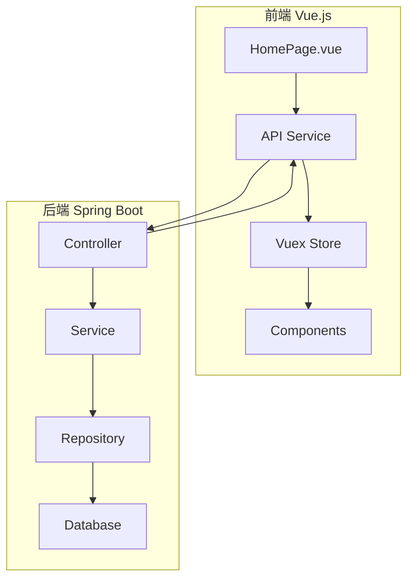

# 前后端集成指南 - 主界面开发

## 📋 概述

本指南详细说明了主界面（HomePage）前后端集成的完整流程，包括开发环境配置、API调用、数据流设计、错误处理等。

## 🏗️ 系统架构



## 🔧 开发环境配置

### 1. 前端环境配置

#### 安装依赖
```bash
# 安装项目依赖
npm install

# 安装HTTP客户端
npm install axios

# 安装状态管理
npm install vuex

# 安装UI组件库（可选）
npm install element-ui
```

#### 环境变量配置
```javascript
// .env.development
VUE_APP_API_BASE_URL=http://localhost:8080/api
VUE_APP_WEBSOCKET_URL=ws://localhost:8080/ws

// .env.production  
VUE_APP_API_BASE_URL=https://api.chaoyue.com/api
VUE_APP_WEBSOCKET_URL=wss://api.chaoyue.com/ws
```

#### API客户端配置
```javascript
// src/utils/request.js
import axios from 'axios'
import { Message } from 'element-ui'
import store from '@/store'
import router from '@/router'

const service = axios.create({
  baseURL: process.env.VUE_APP_API_BASE_URL,
  timeout: 10000
})

// 请求拦截器
service.interceptors.request.use(
  config => {
    const token = store.getters.token
    if (token) {
      config.headers['Authorization'] = `Bearer ${token}`
    }
    return config
  },
  error => {
    console.error('Request error:', error)
    return Promise.reject(error)
  }
)

// 响应拦截器
service.interceptors.response.use(
  response => {
    const res = response.data
    
    if (res.code !== 200) {
      Message.error(res.message || '请求失败')
      
      // 401: 未授权，跳转登录
      if (res.code === 401) {
        store.dispatch('user/logout').then(() => {
          router.push('/login')
        })
      }
      
      return Promise.reject(new Error(res.message || '请求失败'))
    }
    
    return res
  },
  error => {
    console.error('Response error:', error)
    
    let message = '网络错误'
    if (error.response) {
      switch (error.response.status) {
        case 400:
          message = '请求参数错误'
          break
        case 401:
          message = '未授权，请重新登录'
          store.dispatch('user/logout').then(() => {
            router.push('/login')
          })
          break
        case 403:
          message = '权限不足'
          break
        case 404:
          message = '请求的资源不存在'
          break
        case 500:
          message = '服务器内部错误'
          break
        default:
          message = `连接错误${error.response.status}`
      }
    }
    
    Message.error(message)
    return Promise.reject(error)
  }
)

export default service
```

### 2. 后端环境配置

#### Maven依赖
```xml
<!-- pom.xml -->
<dependencies>
    <!-- Spring Boot Starter Web -->
    <dependency>
        <groupId>org.springframework.boot</groupId>
        <artifactId>spring-boot-starter-web</artifactId>
    </dependency>
    
    <!-- Spring Boot Starter Data JPA -->
    <dependency>
        <groupId>org.springframework.boot</groupId>
        <artifactId>spring-boot-starter-data-jpa</artifactId>
    </dependency>
    
    <!-- MySQL Driver -->
    <dependency>
        <groupId>mysql</groupId>
        <artifactId>mysql-connector-java</artifactId>
        <scope>runtime</scope>
    </dependency>
    
    <!-- Redis -->
    <dependency>
        <groupId>org.springframework.boot</groupId>
        <artifactId>spring-boot-starter-data-redis</artifactId>
    </dependency>
    
    <!-- JWT -->
    <dependency>
        <groupId>io.jsonwebtoken</groupId>
        <artifactId>jjwt</artifactId>
        <version>0.9.1</version>
    </dependency>
    
    <!-- Validation -->
    <dependency>
        <groupId>org.springframework.boot</groupId>
        <artifactId>spring-boot-starter-validation</artifactId>
    </dependency>
</dependencies>
```

#### 应用配置
```yaml
# application.yml
spring:
  application:
    name: chaoyue-business-api
    
  datasource:
    url: jdbc:mysql://localhost:3306/chaoyue_business?useUnicode=true&characterEncoding=utf8&serverTimezone=GMT%2B8
    username: ${DB_USERNAME:root}
    password: ${DB_PASSWORD:password}
    driver-class-name: com.mysql.cj.jdbc.Driver
    
  jpa:
    hibernate:
      ddl-auto: update
    show-sql: false
    properties:
      hibernate:
        format_sql: true
        dialect: org.hibernate.dialect.MySQL8Dialect
        
  redis:
    host: ${REDIS_HOST:localhost}
    port: ${REDIS_PORT:6379}
    password: ${REDIS_PASSWORD:}
    timeout: 3000ms
    lettuce:
      pool:
        max-active: 8
        max-idle: 8
        min-idle: 0
        
  jackson:
    date-format: yyyy-MM-dd HH:mm:ss
    time-zone: GMT+8
    
server:
  port: 8080
  servlet:
    context-path: /api
    
logging:
  level:
    com.chaoyue.business: DEBUG
    org.springframework.web: DEBUG
    
# JWT配置
jwt:
  secret: chaoyue-business-secret-key-2024
  expiration: 86400 # 24小时
  
# 业务配置
business:
  dashboard:
    refresh-interval: 300 # 5分钟
  alert:
    max-display: 5
```

## 📡 API服务层设计

### 1. 前端API服务
```javascript
// src/api/dashboard.js
import request from '@/utils/request'

export default {
  // 获取销售数据概览
  getSalesOverview() {
    return request({
      url: '/dashboard/sales-overview',
      method: 'get'
    })
  },
  
  // 获取数据详情
  getDataDetail(type) {
    return request({
      url: `/dashboard/data-detail/${type}`,
      method: 'get'
    })
  },
  
  // 获取销售趋势
  getSalesTrend(params) {
    return request({
      url: '/dashboard/sales-trend',
      method: 'get',
      params
    })
  }
}
```

```javascript
// src/api/alerts.js
import request from '@/utils/request'

export default {
  // 获取预警列表
  getList(params) {
    return request({
      url: '/alerts/list',
      method: 'get',
      params
    })
  },
  
  // 标记为已读
  markAsRead(alertId) {
    return request({
      url: `/alerts/${alertId}/read`,
      method: 'put'
    })
  },
  
  // 获取预警详情
  getDetail(alertId) {
    return request({
      url: `/alerts/${alertId}/detail`,
      method: 'get'
    })
  }
}
```

```javascript
// src/api/index.js - 统一导出
import dashboard from './dashboard'
import alerts from './alerts'
import search from './search'
import user from './user'
import goals from './goals'

export default {
  dashboard,
  alerts,
  search,
  user,
  goals
}
```

### 2. Vue组件中的使用
```javascript
// src/views/HomePage.vue
<template>
  <div class="home-page">
    <!-- 数据看板 -->
    <div class="data-dashboard" v-loading="loading.dashboard">
      <div class="sales-card">
        <div class="sales-value">{{ salesData.currentMonth.totalSales | currency }}</div>
        <div class="sales-label">本月销售金额</div>
      </div>
    </div>
    
    <!-- 预警信息 -->
    <div class="alert-banner" v-if="currentAlert">
      <span>{{ currentAlert.message }}</span>
    </div>
  </div>
</template>

<script>
import api from '@/api'

export default {
  name: 'HomePage',
  
  data() {
    return {
      salesData: {
        currentMonth: {},
        lastMonth: {},
        today: {},
        yesterday: {}
      },
      alerts: [],
      currentAlert: null,
      loading: {
        dashboard: false,
        alerts: false
      },
      refreshTimer: null
    }
  },
  
  async mounted() {
    await this.initializeData()
    this.startAutoRefresh()
  },
  
  beforeDestroy() {
    if (this.refreshTimer) {
      clearInterval(this.refreshTimer)
    }
  },
  
  methods: {
    async initializeData() {
      try {
        await Promise.all([
          this.loadSalesData(),
          this.loadAlerts(),
          this.loadFunctionConfig()
        ])
      } catch (error) {
        console.error('初始化数据失败:', error)
      }
    },
    
    async loadSalesData() {
      this.loading.dashboard = true
      try {
        const response = await api.dashboard.getSalesOverview()
        this.salesData = response.data
      } catch (error) {
        this.$message.error('加载销售数据失败')
      } finally {
        this.loading.dashboard = false
      }
    },
    
    async loadAlerts() {
      this.loading.alerts = true
      try {
        const response = await api.alerts.getList({ 
          unreadOnly: true, 
          limit: 5 
        })
        this.alerts = response.data.content
        this.startAlertRotation()
      } catch (error) {
        this.$message.error('加载预警信息失败')
      } finally {
        this.loading.alerts = false
      }
    },
    
    startAutoRefresh() {
      this.refreshTimer = setInterval(() => {
        this.loadSalesData()
        this.loadAlerts()
      }, 300000) // 5分钟刷新一次
    },
    
    startAlertRotation() {
      if (this.alerts.length > 0) {
        let currentIndex = 0
        this.currentAlert = this.alerts[0]
        
        setInterval(() => {
          currentIndex = (currentIndex + 1) % this.alerts.length
          this.currentAlert = this.alerts[currentIndex]
        }, 5000) // 5秒切换一次
      }
    }
  },
  
  filters: {
    currency(value) {
      if (!value) return '0.00'
      return Number(value).toLocaleString('zh-CN', {
        style: 'currency',
        currency: 'CNY'
      })
    }
  }
}
</script>
```

## 🔄 状态管理 (Vuex)

### 1. Store模块设计
```javascript
// src/store/modules/dashboard.js
import api from '@/api'

const state = {
  salesData: {
    currentMonth: {},
    lastMonth: {},
    today: {},
    yesterday: {}
  },
  alerts: [],
  functionConfig: [],
  goals: [],
  loading: false,
  lastUpdateTime: null
}

const mutations = {
  SET_SALES_DATA(state, data) {
    state.salesData = data
    state.lastUpdateTime = new Date()
  },
  
  SET_ALERTS(state, alerts) {
    state.alerts = alerts
  },
  
  SET_FUNCTION_CONFIG(state, config) {
    state.functionConfig = config
  },
  
  SET_GOALS(state, goals) {
    state.goals = goals
  },
  
  SET_LOADING(state, loading) {
    state.loading = loading
  },
  
  MARK_ALERT_READ(state, alertId) {
    const alert = state.alerts.find(a => a.id === alertId)
    if (alert) {
      alert.isRead = true
    }
  }
}

const actions = {
  async fetchSalesData({ commit }) {
    commit('SET_LOADING', true)
    try {
      const response = await api.dashboard.getSalesOverview()
      commit('SET_SALES_DATA', response.data)
      return response.data
    } finally {
      commit('SET_LOADING', false)
    }
  },
  
  async fetchAlerts({ commit }, params = {}) {
    try {
      const response = await api.alerts.getList(params)
      commit('SET_ALERTS', response.data.content)
      return response.data
    } catch (error) {
      console.error('获取预警失败:', error)
      throw error
    }
  },
  
  async markAlertAsRead({ commit }, alertId) {
    try {
      await api.alerts.markAsRead(alertId)
      commit('MARK_ALERT_READ', alertId)
    } catch (error) {
      console.error('标记预警失败:', error)
      throw error
    }
  }
}

const getters = {
  unreadAlerts: state => state.alerts.filter(alert => !alert.isRead),
  highPriorityAlerts: state => state.alerts.filter(alert => alert.priority === 'high'),
  isDataStale: state => {
    if (!state.lastUpdateTime) return true
    const now = new Date()
    const diff = now - state.lastUpdateTime
    return diff > 300000 // 5分钟
  }
}

export default {
  namespaced: true,
  state,
  mutations,
  actions,
  getters
}
```

### 2. 在组件中使用Store
```javascript
// 使用mapState, mapActions等辅助函数
import { mapState, mapActions, mapGetters } from 'vuex'

export default {
  computed: {
    ...mapState('dashboard', ['salesData', 'alerts', 'loading']),
    ...mapGetters('dashboard', ['unreadAlerts', 'isDataStale'])
  },
  
  methods: {
    ...mapActions('dashboard', ['fetchSalesData', 'fetchAlerts', 'markAlertAsRead']),
    
    async refreshData() {
      try {
        await Promise.all([
          this.fetchSalesData(),
          this.fetchAlerts()
        ])
        this.$message.success('数据刷新成功')
      } catch (error) {
        this.$message.error('数据刷新失败')
      }
    }
  }
}
```

## 🔒 认证与权限

### 1. JWT Token管理
```javascript
// src/utils/auth.js
const TOKEN_KEY = 'chaoyue_token'
const USER_KEY = 'chaoyue_user'

export function getToken() {
  return localStorage.getItem(TOKEN_KEY)
}

export function setToken(token) {
  return localStorage.setItem(TOKEN_KEY, token)
}

export function removeToken() {
  return localStorage.removeItem(TOKEN_KEY)
}

export function getUser() {
  const user = localStorage.getItem(USER_KEY)
  return user ? JSON.parse(user) : null
}

export function setUser(user) {
  return localStorage.setItem(USER_KEY, JSON.stringify(user))
}

export function removeUser() {
  return localStorage.removeItem(USER_KEY)
}
```

### 2. 路由守卫
```javascript
// src/router/index.js
import { getToken } from '@/utils/auth'

router.beforeEach((to, from, next) => {
  const hasToken = getToken()
  
  if (to.path === '/login') {
    if (hasToken) {
      next({ path: '/' })
    } else {
      next()
    }
  } else {
    if (hasToken) {
      next()
    } else {
      next('/login')
    }
  }
})
```

## 🚨 错误处理

### 1. 全局错误处理
```javascript
// src/utils/errorHandler.js
export function handleApiError(error, context) {
  console.error('API Error:', error)
  
  let message = '操作失败'
  
  if (error.response) {
    const { status, data } = error.response
    
    switch (status) {
      case 400:
        message = data.message || '请求参数错误'
        break
      case 401:
        message = '登录已过期，请重新登录'
        // 跳转到登录页
        context.$router.push('/login')
        break
      case 403:
        message = '权限不足'
        break
      case 404:
        message = '请求的资源不存在'
        break
      case 500:
        message = '服务器内部错误，请稍后重试'
        break
      default:
        message = `请求失败 (${status})`
    }
  } else if (error.request) {
    message = '网络连接失败，请检查网络'
  }
  
  context.$message.error(message)
  return Promise.reject(error)
}
```

### 2. 组件级错误处理
```javascript
// 在组件中使用
async loadData() {
  try {
    const data = await api.dashboard.getSalesOverview()
    this.salesData = data
  } catch (error) {
    this.handleApiError(error, this)
  }
}
```

## 📊 性能优化

### 1. 数据缓存策略
```javascript
// src/utils/cache.js
class DataCache {
  constructor() {
    this.cache = new Map()
    this.expireTime = 5 * 60 * 1000 // 5分钟
  }
  
  set(key, data) {
    this.cache.set(key, {
      data,
      timestamp: Date.now()
    })
  }
  
  get(key) {
    const item = this.cache.get(key)
    if (!item) return null
    
    if (Date.now() - item.timestamp > this.expireTime) {
      this.cache.delete(key)
      return null
    }
    
    return item.data
  }
  
  clear() {
    this.cache.clear()
  }
}

export default new DataCache()
```

### 2. 防抖节流
```javascript
// src/utils/debounce.js
export function debounce(func, wait) {
  let timeout
  return function executedFunction(...args) {
    const later = () => {
      clearTimeout(timeout)
      func(...args)
    }
    clearTimeout(timeout)
    timeout = setTimeout(later, wait)
  }
}

export function throttle(func, limit) {
  let inThrottle
  return function() {
    const args = arguments
    const context = this
    if (!inThrottle) {
      func.apply(context, args)
      inThrottle = true
      setTimeout(() => inThrottle = false, limit)
    }
  }
}
```

---

**文档版本**: v1.0  
**最后更新**: 2025-08-15  
**维护人员**: 前端开发团队
